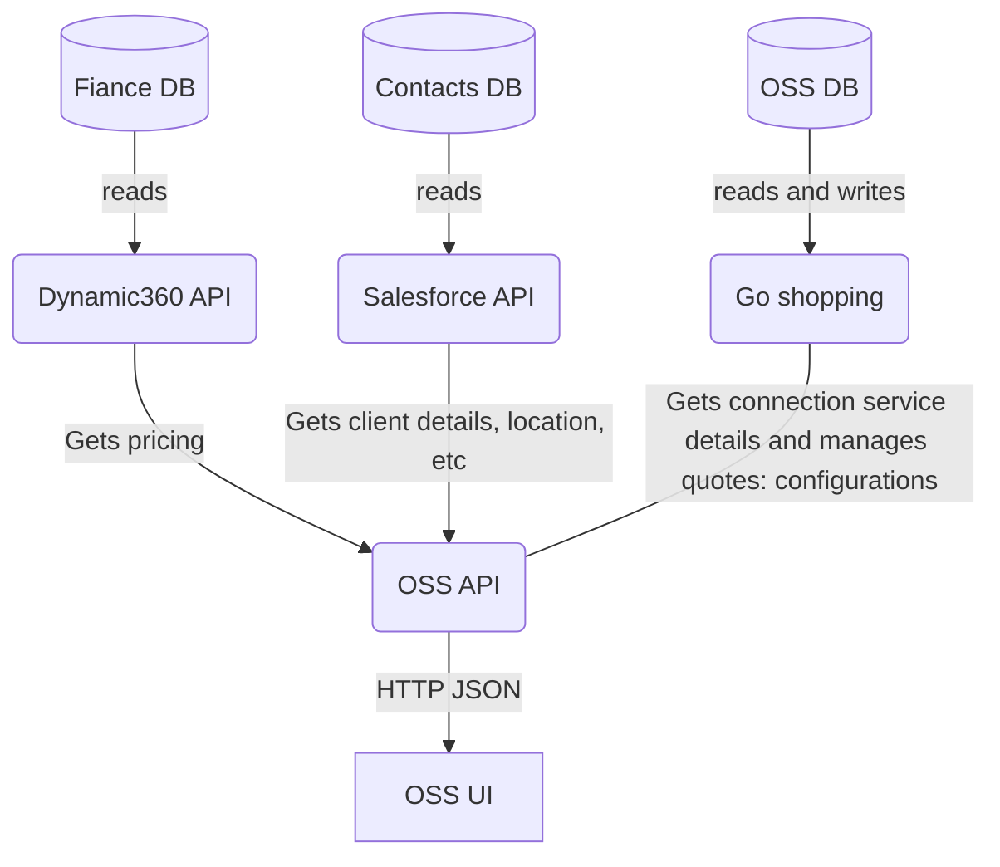

# test1

asdasdasd

adasdasdas

a

sdasd

asdas

# test2

```mermaid
graph TD
  C1(OSS API)
  click C1 "#test1" "test1"

  A1[(Fiance DB)] -- reads --> B1(Dynamic360 API)
  B1 -- Gets pricing--> C1

  A[(Contacts DB)] -- reads --> B(Salesforce API)
  B --> |Gets client details, location, etc| C1

	A2[(OSS DB)] -- reads and writes --> B2(Go shopping)
  B2 -- Gets connection service details and manages quotes: configurations --- C1
  
  C1 -- HTTP JSON --> D1[OSS UI]
```

[dsad](#test2)
